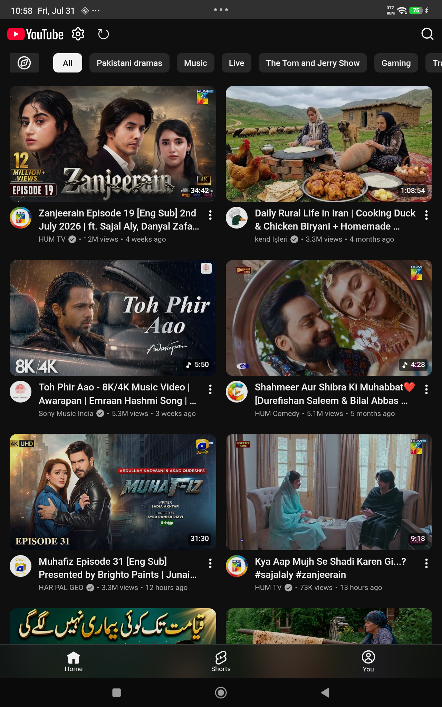
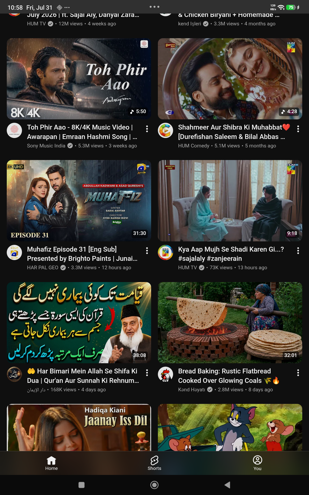
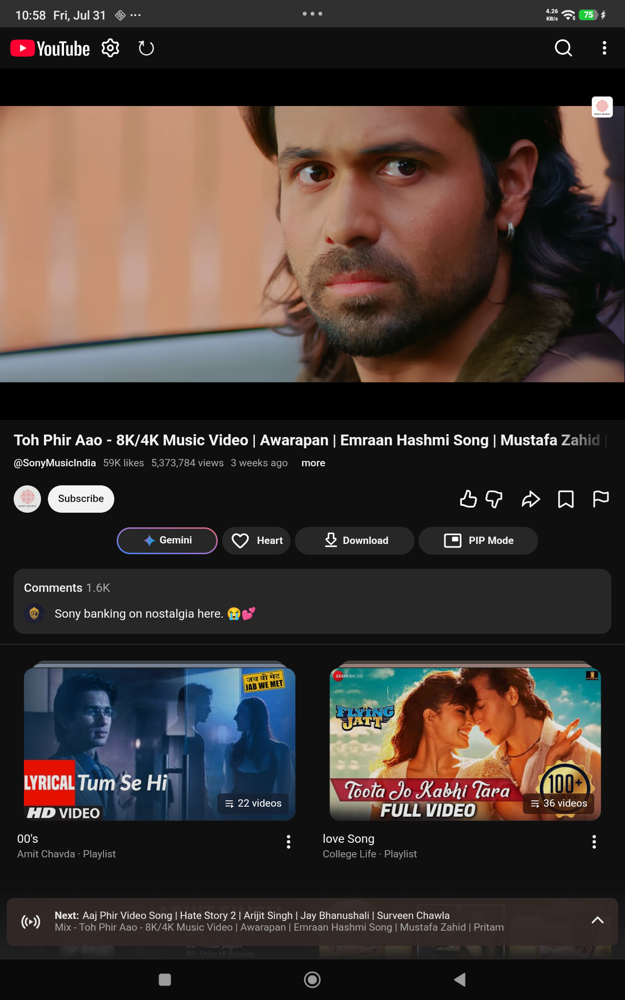
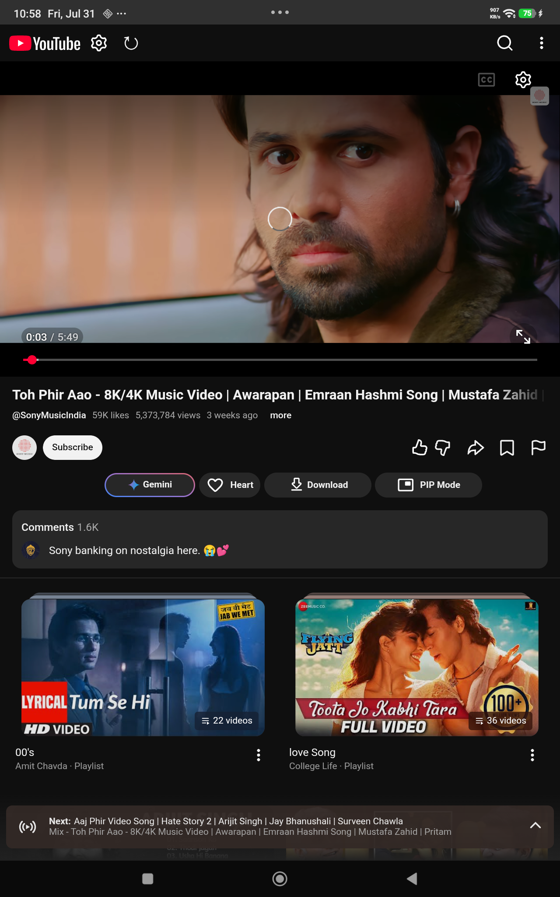
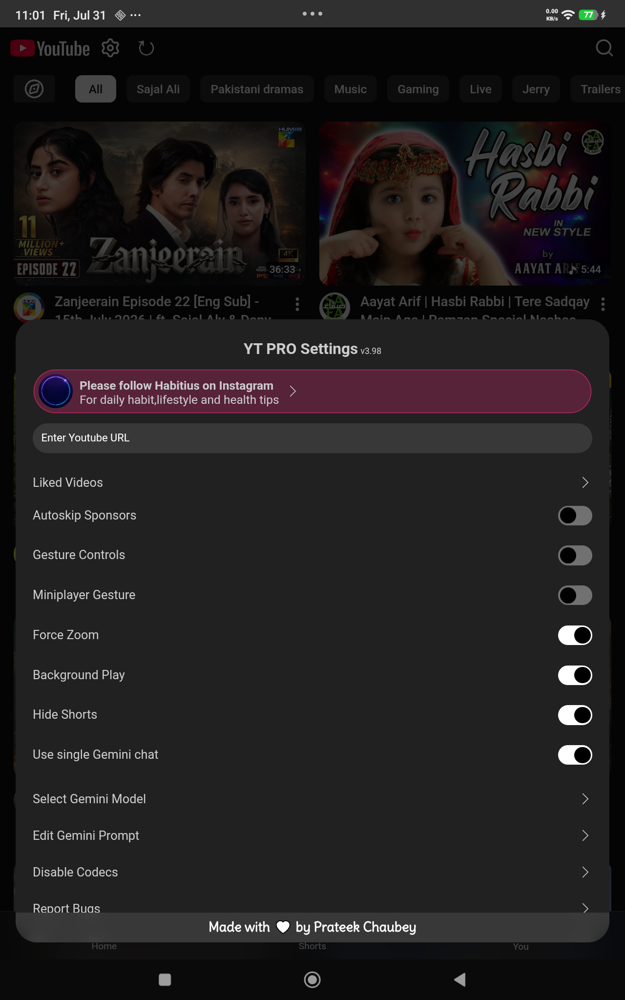
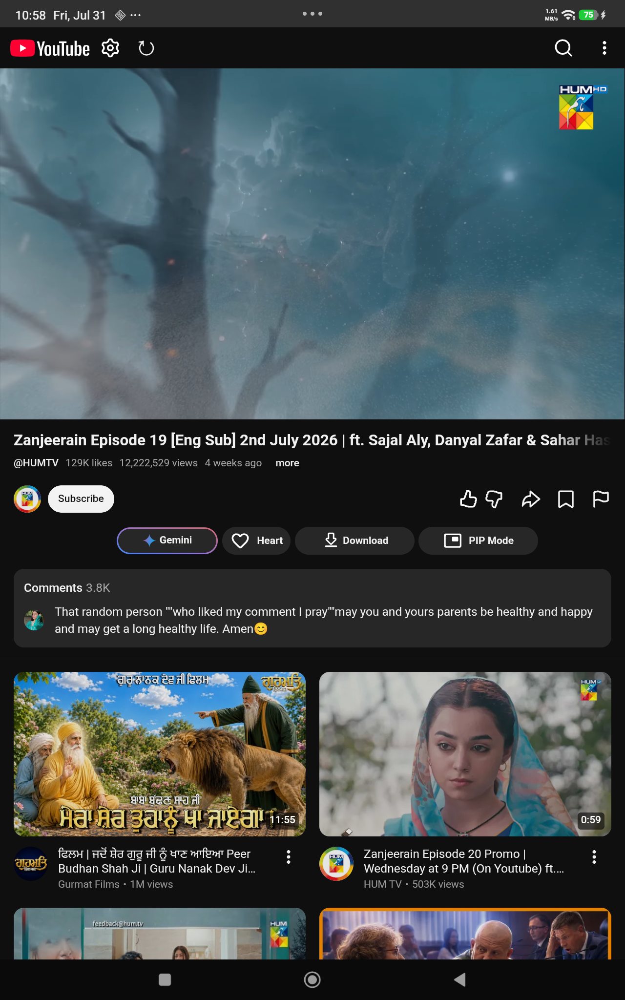
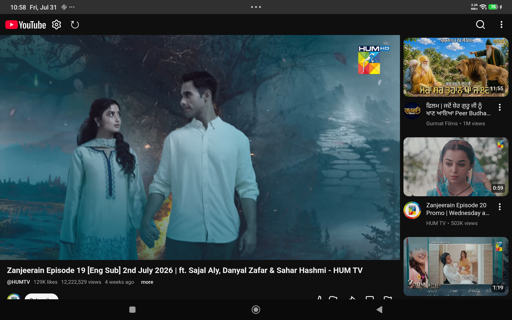

<h1 align=center>YT Pro</h1>

A powerful YouTube client for Android with video downloads, Gemini AI summaries, and advanced playback features.

## Download

Get the latest release from the [Releases](https://github.com/SyedHaseeb1/yt-pro-decoderium/releases) page.

## Screenshots

### Portrait Mode
Optimized for mobile viewing with full feature access.

| Home | Browse | Video Player |
|:--:|:--:|:--:|
|  |  |  |

| Player Controls | Settings & Options | Action Buttons |
|:--:|:--:|:--:|
|  |  |  |

### Landscape Mode
Full immersive video viewing experience.

| Immersive Landscape |
|:--:|
|  |

## Features

**AI & Content**
- Google Gemini AI integration for video summarization
- Customizable prompts and model selection
- SponsorBlock integration to skip sponsored segments
- Return YouTube Dislike API to show dislike counts

**Downloads & Media**
- Download videos, shorts, thumbnails, and captions
- Built-in video and audio muxer for high-quality downloads
- Background audio player
- Up to 10x video playback speed

**Playback & Controls**
- Picture-in-Picture (PiP) mode
- Gesture controls for volume and brightness adjustment
- Full-screen zoom capability
- Media session integration for system notifications
- Minimize video to corner

**Customization**
- Ad blocking (YouTube ads removed)
- Hide Shorts from feed
- Custom "Heart" feature to save videos locally
- Enable/disable specific media codecs
- Customize UI settings

**Optimization**
- Minimal APK size (~50KB)
- Almost zero internal dependencies
- Adaptive UI icons
- Auto-update capability

## Gemini Prompt
The available variables for gemini prompt are
* `{url}` : The URL of the video
* `{title}` : Title of the video
* `{videoId}` : Video Id of the video

## Roadmap

**Current Focus: UX & Quality Improvements**
- [ ] Refine WebView interactions for smoother, "native-feel" navigation
- [ ] Enhance UI consistency between injected JavaScript and native components
- [ ] Optimize script injection timing to eliminate layout shifts (CLS)
- [ ] Implement robust error handling for network and injection failures
- [ ] Improve memory management for long-running streaming sessions

**Feature Backlog**
- [ ] Enhanced audio processing
- [ ] Skip silence detection
- [ ] Adaptive bitrate streaming
- [ ] Extended gesture controls

## Credits

This project builds on these excellent open-source projects:
- [SponsorBlock](https://github.com/ajayyy/SponsorBlock) - Sponsor segment detection
- [Return YouTube Dislike](https://github.com/Anarios/return-youtube-dislike) - Dislike count restoration
- [YouTube.js](https://github.com/LuanRT/YouTube.js/) - YouTube API utilities

## Technical Overview

YT Pro is built as an educational demonstration of JavaScript injection into Android WebViews. While it utilizes the YouTube mobile web interface for streaming, this branch focuses on elevating the **UX and Quality** to bridge the gap between web-based and native experiences.

It showcases:
- High-performance WebView customization and JS bridging
- Advanced media controls and background playback
- Network interception and API manipulation
- UI enhancement through precision DOM manipulation

See [DOCS/](DOCS/) for detailed architecture documentation.

## License

This project is provided as-is for educational purposes. See [LICENSE](LICENSE) for details.

## Disclaimer

This is an educational project demonstrating web technologies and JavaScript injection techniques. Use responsibly and respect YouTube's terms of service.
